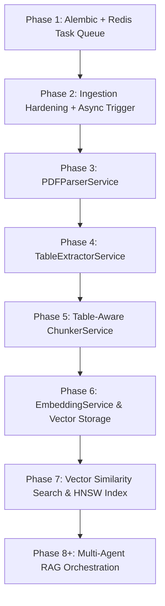

# FinSight Phase 1 Baseline Implementation Report

**Date:** 2026-08-19  
**Branch:** `feat/pdf-parsing` (HEAD commit: `0692196`)  
**Target Milestone:** Phase 1 — Repository Baseline, Async Task Infrastructure & Migration Tooling

---

## 1. Executive Summary & Repository Verification

A complete architectural inspection of the repository was conducted to establish ground truth before initiating Phase 1 development.

| Attribute | Verified Value / Reality |
| :--- | :--- |
| **Actual Repository Root** | `d:\Portfolio soft projects\finsight\` (Contains `.git/`, `.venv/`, `plan.md`, `README.md`, `finsight/`) |
| **Actual Backend Root** | `d:\Portfolio soft projects\finsight\finsight\backend\` |
| **Nested Structure** | **Yes**, the nested `finsight/` directory structure persists. Docker Compose, `.env`, `backend/`, and `frontend/` all reside under `d:\Portfolio soft projects\finsight\finsight/`. |
| **Host Python Version** | `Python 3.13.14` (in local environment/venv) |
| **Container Python Version** | `python:3.11-slim` (defined in `backend/Dockerfile`) |
| **Docker Compose Location** | `finsight/docker-compose.yml` |

---

## 2. Current Architecture & Component Assessment

### 2.1 Container & Infrastructure Setup
- **PostgreSQL Database:**
  - Image: `pgvector/pgvector:pg16`
  - Container Name: `finsight_postgres`
  - Ports: `5432:5432`
  - Healthcheck: `pg_isready -U finsight_user -d finsight_db`
  - Initialization: Mounts `./scripts/init.sql` (`CREATE EXTENSION IF NOT EXISTS vector;`)
- **Redis Cache & Queue:**
  - Image: `redis:7-alpine`
  - Container Name: `finsight_redis`
  - Ports: `6379:6379`
  - Healthcheck: `redis-cli ping`
- **FastAPI Backend:**
  - Base Image: `python:3.11-slim`
  - Container Name: `finsight_backend`
  - Ports: `8000:8000`
  - Mounts: `./backend:/app` and `./backend/storage:/app/storage`
  - Run Command: `uvicorn app.main:app --host 0.0.0.0 --port 8000 --reload`
  - Dependency: Waits on `postgres` and `redis` healthy status.

### 2.2 Current Dependency Versions (`backend/requirements.txt`)
- `fastapi==0.104.1`
- `uvicorn[standard]==0.24.0`
- `sqlalchemy==2.0.23`
- `asyncpg==0.29.0`
- `pgvector==0.2.4`
- `pydantic-settings==2.1.0`
- `python-dotenv==1.0.0`
- `redis==5.0.1`
- `httpx==0.25.2`
- `aiofiles==23.2.1`
- `python-multipart==0.0.6`

### 2.3 Database Layer, Lifespan & Schema Initialization
- **Engine & Session:** `create_async_engine` and `async_sessionmaker` configured in `app/core/database.py` with connection pool size 5 (max overflow 10).
- **ORM Base:** `class Base(DeclarativeBase)` in `app/core/database.py`.
- **Model Registration:** Models (`Document`, `Chunk`, `Report`) are imported in `app/models/__init__.py` and referenced directly in `app/main.py`.
- **Table Creation:** Currently handled on startup in the FastAPI `lifespan` hook via `await init_db()` which runs `Base.metadata.create_all`.
- **Alembic / Migrations:** **Zero migration configuration exists.** No `alembic.ini`, no `alembic/` folder, and no version history.

### 2.4 State of Redis & Background Tasks
- **Redis Import & Usage:** Redis is present in `requirements.txt` and `REDIS_URL` property is configured in `app/core/config.py`, but **`redis` is not imported or used anywhere in application code**.
- **Background Tasks:** No Celery, ARQ, SAQ, or FastAPI `BackgroundTasks` abstraction exists in the codebase.
- **Document Status State Machine:** `Document.status` defaults to `"pending"` (string column). When files are uploaded via `POST /api/v1/documents/upload`, the record is saved to DB and disk, and returned in `pending` state with **no background processing triggered**.

### 2.5 Document Models & Routes
- **`Document` Model (`app/models/document.py`):** UUID primary key, string status, file metadata (`filename`, `file_type`, `file_size`, `title`, `description`, `source`), chunk/page counters, UTC timestamps, `chunks` relationship (`selectin` lazy load, cascade delete).
- **`Chunk` Model (`app/models/chunk.py`):** UUID primary key, `document_id` foreign key with cascade delete, `content` (Text), `embedding` (`Vector(1536)`), `chunk_type` (String, default "text"), `chunk_index` (Integer), `page_number` (Integer, nullable), `metadata_` (JSONB).
- **`Report` Model (`app/models/report.py`):** UUID primary key, `query`, `response`, `sources` (JSONB), `report_type`, `status`.
- **`DocumentService` (`app/services/document_service.py`):** Validates extension and file size (50MB limit), asynchronously streams file to disk in `/app/storage/documents/`, inserts DB record, lists and deletes documents with disk cleanup.
- **Routes (`app/api/routes/documents.py`):** `POST /upload`, `GET /`, `GET /{document_id}`, `DELETE /{document_id}`.

---

## 3. Plan.md vs. Codebase Gap Analysis

| Component | `plan.md` Specification | Actual Codebase Reality | Status |
| :--- | :--- | :--- | :--- |
| **Migration Tooling** | Alembic migrations for DB schema & HNSW vector indexes | `Base.metadata.create_all` in `main.py` lifespan | ❌ Missing |
| **Async Task Pipeline** | Redis task queue (ARQ / worker) for background parsing | Redis container is idle; no worker or queue code exists | ❌ Missing |
| **Error Handling** | Standardized service exception hierarchy & uniform error schemas | Direct `HTTPException` raises inside services/routes | ⚠️ Suboptimal |
| **Document Processing** | Status transitions `pending` -> `processing` -> `parsed` -> `indexed` | Stays in `pending` indefinitely upon upload | ❌ Incomplete |
| **PDF Parser Service** | Page-by-page extraction, boundary tracking | Branch named `feat/pdf-parsing` but service is missing | ❌ Not Implemented |
| **Table Extraction & Chunking** | Financial statement table preservation & vector chunking | No table extractor or chunking modules | ❌ Not Implemented |
| **Vector Embeddings** | Batch OpenAI embeddings & HNSW indexing | `Vector(1536)` column exists; no embedding logic or index | ❌ Not Implemented |

---

## 4. Key Risks & Technical Debt

1. **Schema Divergence Risk:** Creating vector indexes (HNSW) and future model fields without Alembic will cause schema drift between local Docker environments and production.
2. **Synchronous Upload Bottleneck:** If PDF parsing and chunking are invoked inside the HTTP request cycle rather than offloaded to an asynchronous task queue, file uploads will freeze client connections and timeout on large 10-K filings (100+ pages).
3. **Missing Magic-Byte File Validation:** Relying solely on `file.filename.split(".")[-1]` allows malicious file extension spoofing.
4. **Nested Root Confusion:** The presence of `finsight/finsight/` requires care when specifying working directories and Docker build contexts.

---

## 5. Dependencies Between Upcoming Sprints & Phases

- **Phase 3 (PDF Parsing)** cannot run end-to-end automatically without **Phase 1 & 2 (Async Queue & Worker)** unless invoked synchronously.
- **Phase 6 & 7 (Embedding & Vector Search)** depend on **Phase 1 (Alembic)** to generate and manage the `pgvector` HNSW index migration.

---

## 6. Recommendations for Next Sprint (Sprint 1.2 Execution)

1. **Alembic Setup & Baseline Migration:**
   - Add `alembic` to `backend/requirements.txt`.
   - Initialize Alembic inside `backend/` with async SQLAlchemy template (`env.py` pointing to `Base.metadata` and `settings.DATABASE_URL`).
   - Generate initial migration for `documents`, `chunks`, and `reports`.
   - Transition `app/main.py` lifespan away from `Base.metadata.create_all` in favor of managed migrations.
2. **Redis Task Queue Infrastructure:**
   - Select lightweight async task queue runner (e.g., `ARQ` or dedicated Redis worker).
   - Implement `TaskQueue` service / client in `app/core/tasks.py`.
   - Hook document upload endpoint so uploaded files enqueue an ingestion task and update `Document.status = "processing"`.
3. **Standardized Error Handling:**
   - Introduce custom base exceptions in `app/core/exceptions.py` (e.g., `DocumentNotFoundError`, `FileValidationError`, `ProcessingError`).
   - Create FastAPI exception handlers returning consistent JSON error envelopes.
