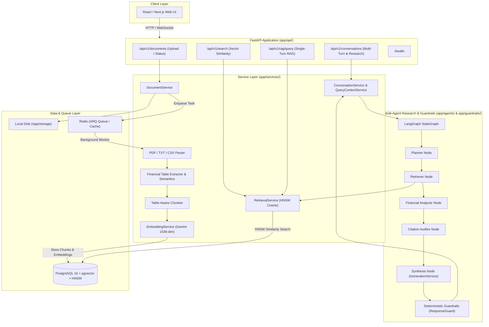

# FinSight — Master Implementation Plan & Roadmap 🚀

This document defines the comprehensive, grounded implementation roadmap for **FinSight**, an AI-powered financial intelligence & investment research copilot.

---

## 1. Actual Current State Assessment

This assessment is strictly grounded on the current repository codebase (`finsight/`), models, services, routes, Docker configuration, and test suites.

### ✅ Completed & Verified in Code
* **Container & Infrastructure Orchestration:**
  * `docker-compose.yml` with PostgreSQL 16 (`pgvector/pgvector:pg16`), Redis 7 Alpine, FastAPI backend, and ARQ background worker.
  * HNSW vector cosine index (`ix_chunks_embedding_hnsw_cosine`) active on `chunks.embedding`.
* **Document Ingestion & Multi-Format Parsing:**
  * PDF, TXT, and CSV multi-format ingestion pipelines with magic-byte security validation.
  * Table extraction (`pdfplumber`) and deterministic semantic financial statement classification (`table_semantics.py`).
  * Table-aware chunking preserving tabular markdown structures and fiscal period metadata.
* **Vector Embeddings & Retrieval Foundation:**
  * Google Gemini embeddings (`gemini-embedding-2`, 1536-dim, `RETRIEVAL_DOCUMENT` / `RETRIEVAL_QUERY`).
  * In-database pgvector cosine search and HNSW retrieval with 100% Recall@5.
* **Grounded Single-Turn & Multi-Turn Conversational RAG:**
  * Grounded answer synthesis via `GenerationService` with structured `[SOURCE N]` citations.
  * Multi-turn conversational memory (`ConversationSession`, `ConversationMessage`) with follow-up query rewriting and strict session isolation.
* **Multi-Agent Financial Research (LangGraph):**
  * Coordinated acyclic `StateGraph` workflow (`Planner -> Retriever -> Analyzer -> Auditor -> Synthesis`).
  * Deterministic financial ratio calculations (Gross/Net Margins, YoY growth) in Python arithmetic.
  * Citation auditing validating findings against PostgreSQL chunk records.
* **Deterministic Guardrails AI Output Validation:**
  * Pydantic v2 runtime output guardrails layer (`StructureValidator`, `FinancialFindingValidator`, `CitationValidator`, `GroundingConsistencyValidator`, `ResponseGuard`).
  * Post-synthesis response gatekeeper ensuring citation provenance, non-empty text, and grounding consistency.
* **Test Verification:**
  * **222 Pytest unit & integration tests passing** (100% pass rate).
  * **9 Docker E2E scenarios passing** (E2E 1 through E2E 9).
  * **Final System Audit:** `PRODUCTION-READY FOUNDATION`.

---

## 2. Intended System Architecture

---

## 3. Implementation Roadmap (Phases 1 to 16)

---

### Phase 1 — Repository Baseline & Async Task Infrastructure
* **Goal:** Establish migration tooling (Alembic), configure background task worker with Redis, and standardize backend dependencies.
* **Why Needed:** Document parsing and embedding are long-running operations that will timeout or block HTTP requests. Alembic is essential for managing vector index creation and future schema changes.
* **Current Status:** Completed (Alembic baseline + ARQ Redis task worker + Standardized errors).
* **Tasks:**
  - [x] Add `alembic` to `backend/requirements.txt` and initialize migrations (`alembic init alembic`).
  - [x] Generate baseline migration representing existing `Document`, `Chunk`, and `Report` tables.
  - [x] Implement async background processing using Redis (`ARQ` worker container with Redis task state tracking).
  - [x] Create standardized service exception classes and uniform API error schemas.
* **Files Likely Affected:**
  - `backend/requirements.txt`
  - `backend/alembic.ini`
  - `backend/alembic/`
  - `backend/app/core/config.py`
  - `backend/app/core/tasks.py`
* **Acceptance Criteria:**
  - Alembic migrations run cleanly against PostgreSQL container.
  - An async task can be enqueued to Redis and execute out-of-band with status reporting.

---

### Phase 2 — Document Ingestion Hardening
* **Goal:** Harden the existing document upload flow with content validation, mime-type verification, and background worker triggering.
* **Why Needed:** Currently, uploads write to disk and DB but stay in `"pending"` status forever.
* **Current Status:** Completed (Magic-byte validation + ARQ worker trigger + Document.status transitions + processing_error).
* **Tasks:**
  - [x] Add magic-byte file header validation (protect against renamed malicious binaries).
  - [x] Trigger background processing pipeline immediately upon successful file upload.
  - [x] Update `Document.status` state machine (`pending` -> `processing` -> `failed`).
  - [x] Add processing error detail field to `Document` model for diagnostic visibility.
* **Files Likely Affected:**
  - `backend/app/models/document.py`
  - `backend/app/services/document_service.py`
  - `backend/app/api/routes/documents.py`
* **Acceptance Criteria:**
  - Uploading a valid PDF triggers background processing and returns `201 Created` with initial document status.

---

### Phase 3 — PDF & Document Parsing
* **Goal:** Implement robust text and page extraction from financial documents (10-K, 10-Q, earnings transcripts).
* **Why Needed:** RAG requires granular text extraction mapped accurately to page numbers for source citations.
* **Current Status:** Completed (Sprint 3.1 PDF parsing + Sprint 3.2 TXT/CSV parsing and conservative boilerplate filtering verified).
* **Tasks:**
  - [x] Add `pypdf==4.1.0` to `backend/requirements.txt`.
  - [x] Create `PDFParserService` (`app/services/pdf_parser.py`) supporting:
    - [x] Page-by-page text extraction and 1-indexed numbering.
    - [x] Page boundary tracking with empty/blank page preservation.
    - [x] Conservative, lightweight text normalization.
    - [x] Document metadata extraction (title, total pages, author/creator/creation date).
  - [x] Handle malformed, missing, and encrypted PDF exceptions gracefully with `document.status = "failed"` and `processing_error`.
  - [x] Wire `process_document` task in `app/tasks/definitions.py` with `Document.status` transition (`pending` -> `processing` -> `parsed`/`failed`).
  - [x] Support plain text (`.txt`) parsing (`TextParserService`) and CSV (`.csv`) parsing (`CSVParserService`) (Sprint 3.2).
  - [x] Conservative repeated boilerplate and header/footer detection (`PDFParserService.filter_repeated_boilerplate`) (Sprint 3.2).
* **Files Likely Affected:**
  - `backend/requirements.txt`
  - `backend/app/services/pdf_parser.py`
  - `backend/app/services/text_parser.py`
  - `backend/app/services/csv_parser.py`
  - `backend/app/tasks/definitions.py`
  - `backend/tests/`
  - `docs/development/pdf-parsing.md`
* **Acceptance Criteria:**
  - Parsed PDF produces a structured document representation (`ParsedDocument` with `ParsedPage`s): page numbers, raw text, and page metadata without dropping pages or crashing on standard corporate 10-K filings.
  - Parsed TXT and CSV produce structured `ParsedDocument`s representing 1 logical page with tabular structure preserved.

---

### Phase 4 — Financial Table Extraction & Semantics
* **Goal:** Extract and preserve structural layout of balance sheets, income statements, and cash flow tables, and enrich them with deterministic semantic classifications.
* **Why Needed:** Financial analysis relies heavily on tabular metrics. Standard text extractors scramble table rows and column headers, making numbers incomprehensible to LLMs.
* **Current Status:** Completed (Sprint 4.1 pdfplumber table extraction + Sprint 4.2 FinancialTableSemanticService statement classification, period extraction, and metric normalization verified).
* **Tasks:**
  - [x] Add `pdfplumber==0.11.0` to `backend/requirements.txt`.
  - [x] Implement table detection and extraction in `TableExtractorService` (`app/services/table_extractor.py`) using `pdfplumber`.
  - [x] Convert extracted tables into markdown format and structured JSON representation (preserving column headers, fiscal periods, currencies, and units).
  - [x] Generate deterministic Markdown and extract headers/titles for tables.
  - [x] Financial Statement Semantic Classification & Period Detection (`FinancialTableSemanticService` in `app/services/table_semantics.py`) (Sprint 4.2).
  - [ ] Table-aware chunking and tagging with `chunk_type = "table"` linked to page numbers (Phase 5).
* **Files Likely Affected:**
  - `backend/requirements.txt`
  - `backend/app/services/table_extractor.py`
  - `backend/app/services/table_semantics.py`
  - `backend/app/tasks/definitions.py`
  - `backend/tests/test_table_extractor.py`
  - `backend/tests/test_table_semantics.py`
  - `docs/development/table-extraction.md`
  - `docs/development/table-semantics.md`
* **Acceptance Criteria:**
  - Financial statements and tabular data in PDFs are extracted into structured `ExtractedTable` objects with aligned rows, columns, monetary units, currencies, Markdown serialization, and semantic classifications (`FinancialTableSemantics`) without creating database Chunk records.

---

### Phase 5 — Table-Aware Chunking Strategy
* **Goal:** Split extracted document text and tables into semantically coherent, citation-traceable chunks and persist them to PostgreSQL.
* **Why Needed:** LLM context windows and embedding models require chunks that do not cut sentences or table rows in half.
* **Current Status:** Completed (Sprint 5.1 TableAwareChunkerService, deterministic text & table chunking, JSONB semantic metadata, and transactional chunk persistence verified).
* **Tasks:**
  - [x] Create `TableAwareChunkerService` (`app/services/chunker.py`) and `ChunkData` contract (Sprint 5.1).
  - [x] Implement recursive text splitter for narrative sections (target size: 1200 characters, overlap: 150 characters) strictly preserving `page_number` (Sprint 5.1).
  - [x] Implement atomic table chunking: Keep PDF tables intact using Markdown formatting, enriched with statement semantics (`statement_type`, `period_type`, `fiscal_periods`, `currency`, `units`, `key_metrics`) (Sprint 5.1).
  - [x] Support plain text (TXT) and CSV structured chunking with repeated header rows for large files (Sprint 5.1).
  - [x] Two-phase transactional chunk persistence in worker pipeline (`app/tasks/definitions.py`) with atomic replacement / idempotency protection (Sprint 5.1).
  - [x] Save generated chunks to PostgreSQL with `chunk_type` (`text` vs `table`) and `embedding = NULL` (Sprint 5.1).
* **Files Likely Affected:**
  - `backend/app/core/config.py`
  - `backend/app/services/chunker.py`
  - `backend/app/tasks/definitions.py`
  - `backend/tests/test_chunker.py`
  - `backend/tests/e2e_test.py`
  - `docs/development/chunking.md`
* **Acceptance Criteria:**
  - Chunks retain complete semantic sentences and table Markdown representations; every chunk contains accurate `page_number`, sequential `chunk_index`, and `document_id`; `Document.total_chunks` matches actual `Chunk` row counts in PostgreSQL with `embedding = NULL`.

---

### Phase 6 — Embedding Pipeline & Vector Retrieval Foundation
* **Goal:** Generate vector embeddings for all document chunks, store them in PostgreSQL via `pgvector`, and execute exact vector similarity searches.
* **Why Needed:** Semantic search and RAG require vector representations and deterministic database similarity retrieval.
* **Current Status:** Completed (Sprint 6.1 Embedding persistence & Document `status = "indexed"` + Sprint 6.2 `RetrievalService`, `POST /api/v1/search`, and in-database pgvector cosine search verified).
* **Tasks:**
  - [x] Add `google-genai==0.8.0` to `backend/requirements.txt` (Sprint 6.1).
  - [x] Implement `EmbeddingService` (`app/services/embedding_service.py`) (Sprint 6.1 & 6.2):
    - [x] Gemini `gemini-embedding-2` model with `RETRIEVAL_DOCUMENT` task type and 1536 output dimensionality (Sprint 6.1).
    - [x] Query embedding generation with `RETRIEVAL_QUERY` task semantics via `EmbeddingService.embed_query` (Sprint 6.2).
    - [x] Deterministic batch embedding generation (batch size = 50) preserving 1-to-1 input-to-output ordering (Sprint 6.1).
    - [x] Bounded exponential backoff retry policy for transient API errors (rate limit, server error, timeout) up to 3 attempts.
    - [x] Strict vector dimension validation (ensuring all returned vectors are exactly 1536 floats).
    - [x] Async client lifecycle management and explicit cleanup via `close()`.
  - [x] Integrate with background worker pipeline (`app/tasks/definitions.py`) (Sprint 6.1):
    - [x] Query persisted chunks and invoke `EmbeddingService.embed_chunks` outside of database transactions (Rule A).
    - [x] Whole-document atomic database persistence with verification (Rule B).
    - [x] Advance `Document.status` to `"indexed"` upon successful embedding persistence.
    - [x] Safe failure recording with sanitized `processing_error` in an isolated error transaction.
    - [x] Zero-chunk handling and idempotency protection (skipping already embedded documents).
  - [x] Implement `RetrievalService` (`app/services/retrieval_service.py`) (Sprint 6.2):
    - [x] Structured `RetrievalResult` dataclass preserving metadata, page numbers, and chunk types.
    - [x] In-database pgvector cosine distance calculation ($1 - \text{cosine\_distance}$).
    - [x] Filter by `Chunk.embedding IS NOT NULL`, `Document.status == "indexed"`, optional `document_id`, and `min_similarity`.
    - [x] Deterministic tie-breaking ordering (`similarity DESC, chunk_index ASC, id ASC`).
    - [x] Top-k limiting and parameter validation ($1 \le \text{top\_k} \le 20$, $0.0 \le \text{min\_similarity} \le 1.0$).
  - [x] Add `POST /api/v1/search` developer and retrieval endpoint in `app/api/routes/search.py` (Sprint 6.2).
  - [x] Unit and database integration test suites (`test_embedding_service.py` with 23 tests, `test_retrieval_service.py` with 24 tests) passing with 0 failures (Sprint 6.1 & 6.2).
  - [x] Update E2E test suite (`e2e_test.py`) with PostgreSQL assertions confirming 1536-dimensional embeddings and vector retrieval against indexed financial statements (Sprint 6.1 & 6.2).
* **Files Likely Affected:**
  - `backend/requirements.txt`
  - `backend/app/core/config.py`
  - `backend/app/services/embedding_service.py`
  - `backend/app/services/retrieval_service.py`
  - `backend/app/schemas/search.py`
  - `backend/app/api/routes/search.py`
  - `backend/app/tasks/definitions.py`
  - `backend/tests/test_embedding_service.py`
  - `backend/tests/test_retrieval_service.py`
  - `backend/tests/e2e_test.py`
  - `docs/development/embeddings.md`
  - `docs/development/vector-retrieval.md`
* **Acceptance Criteria:**
  - Every document chunk is embedded with a 1536-dimensional vector stored in `Chunk.embedding`; `Document.status` reaches `"indexed"`; vector search executes inside PostgreSQL using pgvector cosine distance; all 116 regression tests and 5 E2E pipeline scenarios pass cleanly.

---

### Phase 7 — Grounded RAG Context Assembly & Answer Generation (Sprint 7.1)
* **Goal:** Build the single-turn grounded RAG question-answering pipeline using pgvector retrieval and Gemini 2.0 Flash generation.
* **Why Needed:** Enable users to ask natural-language financial research questions and receive grounded answers backed by structured citations directly referencing indexed text and financial table chunks.
* **Current Status:** **COMPLETED & VERIFIED (Sprint 7.1)**
* **Tasks:**
  - [x] Implement `GenerationService` with async `google-genai` SDK, system instructions, and deterministic `FakeGenAIClient` for offline testing (`backend/app/services/generation_service.py`).
  - [x] Implement structured data contracts `SourceCitation` and `RAGResponse` (`backend/app/services/rag_service.py`).
  - [x] Implement atomic context assembly with source numbering (`[SOURCE N]`) and 18,000 character limit without splitting chunks.
  - [x] Implement `RAGService.answer()` with input validation, similarity filtering, and insufficient evidence short-circuiting.
  - [x] Implement citation validation and sanitization for out-of-bounds citation markers.
  - [x] Define Pydantic request/response schemas (`backend/app/schemas/rag.py`).
  - [x] Expose `POST /api/v1/rag/query` endpoint with AsyncSession database dependency (`backend/app/api/routes/rag.py`).
  - [x] Add comprehensive unit and API test suite with 30 test cases (`backend/tests/test_rag_service.py`).
  - [x] Add Scenario 6 E2E integration test querying multi-page financial statements in Docker (`backend/tests/e2e_test.py`).
  - [x] Create comprehensive developer documentation (`docs/development/rag.md`).
* **Files Affected:**
  - `backend/app/core/config.py`
  - `backend/app/services/generation_service.py`
  - `backend/app/services/rag_service.py`
  - `backend/app/schemas/rag.py`
  - `backend/app/api/routes/rag.py`
  - `backend/app/main.py`
  - `backend/tests/test_rag_service.py`
  - `backend/tests/e2e_test.py`
  - `docs/development/rag.md`
  - `plan.md`
* **Acceptance Criteria:**
  - `POST /api/v1/rag/query` answers financial questions with accurate context and citations.
  - Returns `grounded: false` without LLM calls when evidence is below relevance threshold.
  - All 146 backend tests and all 6 Docker E2E scenarios pass cleanly.

---

### Phase 8 — Vector Index Optimization (HNSW) & Conversational Multi-Turn RAG
* **Goal:** Optimize vector retrieval performance using HNSW indexing and implement session-based conversational memory for multi-turn financial research.
* **Why Needed:** Enhance vector retrieval scale and support iterative financial analysis workflows.
* **Current Status:** **Phase 8 COMPLETE & VERIFIED (Sprint 8.1 HNSW Optimization + Sprint 8.2 Conversational Memory)**.
* **Tasks:**
  - [x] Add HNSW and benchmark settings (`HNSW_ENABLED`, `HNSW_M`, `HNSW_EF_CONSTRUCTION`, `HNSW_EF_SEARCH`, `RETRIEVAL_RECALL_TARGET`) to `app/core/config.py` (Sprint 8.1).
  - [x] Create reversible Alembic migration `0003_add_hnsw_index.py` creating `ix_chunks_embedding_hnsw_cosine` on `chunks.embedding` with `vector_cosine_ops` (Sprint 8.1).
  - [x] Implement `VectorIndexService` (`app/services/vector_index_service.py`) for PostgreSQL catalog verification (`pg_class`, `pg_index`, `pg_am`, `pg_opclass`) (Sprint 8.1).
  - [x] Update `RetrievalService` with transaction-local `SET LOCAL hnsw.ef_search` tuning (Sprint 8.1).
  - [x] Create benchmark suite `tests/benchmark_retrieval.py` measuring exact vs HNSW latency percentiles (Avg, P50, P95), Recall@5 (100%), and overlap (100%) (Sprint 8.1).
  - [x] Create unit and database integration tests in `tests/test_vector_index.py` (20 tests passed) (Sprint 8.1).
  - [x] Create documentation `docs/development/hnsw-retrieval.md` (Sprint 8.1).
  - [x] Add conversation settings (`CONVERSATION_MAX_HISTORY_MESSAGES`, `CONVERSATION_MAX_MESSAGE_CHARS`, `CONVERSATION_MAX_SESSIONS_MESSAGES`, `CONVERSATION_FOLLOWUP_REWRITE_ENABLED`) to `app/core/config.py` (Sprint 8.2).
  - [x] Create ORM models `ConversationSession` and `ConversationMessage` with cascade delete and indexing in `app/models/conversation.py` (Sprint 8.2).
  - [x] Create reversible Alembic migration `0004_add_conversation_memory.py` (Sprint 8.2).
  - [x] Create Pydantic schemas in `app/schemas/conversation.py` (Sprint 8.2).
  - [x] Implement deterministic follow-up resolution service in `app/services/query_context_service.py` (Sprint 8.2).
  - [x] Implement session orchestration and message lifecycle in `app/services/conversation_service.py` (Sprint 8.2).
  - [x] Expose REST endpoints in `app/api/routes/conversations.py` (`POST /`, `GET /{id}`, `GET /{id}/messages`, `DELETE /{id}`, `POST /{id}/query`) (Sprint 8.2).
  - [x] Create 30 unit, catalog, and integration tests in `tests/test_conversation_service.py` (Sprint 8.2).
  - [x] Update Docker E2E test suite `tests/e2e_test.py` with Scenario 7 multi-turn conversation and session isolation (Sprint 8.2).
  - [x] Create developer documentation `docs/development/conversational-rag.md` (Sprint 8.2).
* **Files Affected:**
  - `backend/app/core/config.py`
  - `backend/app/models/conversation.py`
  - `backend/app/models/__init__.py`
  - `backend/alembic/versions/0003_add_hnsw_index.py`
  - `backend/alembic/versions/0004_add_conversation_memory.py`
  - `backend/alembic/env.py`
  - `backend/app/schemas/conversation.py`
  - `backend/app/services/vector_index_service.py`
  - `backend/app/services/query_context_service.py`
  - `backend/app/services/conversation_service.py`
  - `backend/app/services/retrieval_service.py`
  - `backend/app/api/routes/conversations.py`
  - `backend/app/main.py`
  - `backend/tests/benchmark_retrieval.py`
  - `backend/tests/test_vector_index.py`
  - `backend/tests/test_conversation_service.py`
  - `backend/tests/e2e_test.py`
  - `docs/development/hnsw-retrieval.md`
  - `docs/development/conversational-rag.md`
  - `plan.md`
* **Acceptance Criteria:**
  - HNSW index is active in PostgreSQL; Recall@5 reaches 100%; multi-turn conversations persist message history; follow-ups resolve deterministically; session isolation is strict; all 196 backend tests and all 7 Docker E2E scenarios pass cleanly.

---

### Phase 9 — Multi-Agent Financial Research & Deterministic AI Output Validation (Sprint 9.1 & Sprint 9.2)
* **Goal:** Orchestrate specialized multi-agent workflows using LangGraph and enforce deterministic runtime validation on AI outputs.
* **Why Needed:** Complex financial analysis requires multi-period query decomposition, parallel retrieval deduplication, deterministic mathematical calculations (margins, growth), provenance auditing, and strict output safety gates.
* **Current Status:** **Phase 9 COMPLETE & VERIFIED (Sprint 9.1 LangGraph Multi-Agent Research + Sprint 9.2 Deterministic Output Validation / Guardrails)**.
* **Tasks:**
  - [x] Add `langgraph==0.2.74`, `langchain-core==0.3.43`, `langsmith==0.2.11`, and `websockets==14.2` to `backend/requirements.txt` (Sprint 9.1).
  - [x] Define structured Pydantic contracts and TypedDict state in `app/agents/state.py` (`ResearchState`, `PlannerOutput`, `FinancialFinding`, `FinancialAnalysis`, `AuditedFinding`, `CitationAuditResult`) (Sprint 9.1).
  - [x] Implement deterministic `PlannerNode` (`app/agents/planner.py`) extracting fiscal periods and decomposing queries into bounded subqueries (capped at `AGENT_MAX_SUBQUERIES=4`) (Sprint 9.1).
  - [x] Implement `RetrieverNode` (`app/agents/retriever.py`) reusing `RetrievalService.search()`, deduplicating chunks by `chunk_id`, and preserving highest similarity (Sprint 9.1).
  - [x] Implement deterministic `FinancialAnalyzerNode` (`app/agents/financial_analyzer.py`) extracting metrics and computing gross/net margins and YoY growth with Python arithmetic (Sprint 9.1).
  - [x] Implement `CitationAuditorNode` (`app/agents/citation_auditor.py`) verifying findings against retrieved chunk IDs and rejecting unbacked metrics (Sprint 9.1).
  - [x] Implement `SynthesisNode` (`app/agents/synthesis.py`) combining retrieved chunks with audited findings and calling `GenerationService` with `validate_and_clean_citations()` (Sprint 9.1).
  - [x] Compile acyclic `StateGraph(ResearchState)` in `app/agents/graph.py` with conditional routing for insufficient evidence / failed audits (Sprint 9.1).
  - [x] Implement custom deterministic Guardrails validation layer in `app/guardrails/` (`schemas.py`, `validators.py`, `response_guard.py`) using Pydantic v2 (Sprint 9.2):
    - [x] `StructureValidator`: Validates non-null, non-empty, and maximum character length bounds (`GUARDRAILS_MAX_RESPONSE_LENGTH`).
    - [x] `FinancialFindingValidator`: Validates that all findings contain `source_chunk_ids` present in retrieved PostgreSQL evidence, checks for numeric NaN/Inf values, and enforces percentage sanity bounds.
    - [x] `CitationValidator`: Validates that every citation matches a retrieved chunk ID and strips/re-cleans invalid `[SOURCE N]` references.
    - [x] `GroundingConsistencyValidator`: Rejects outputs claiming `grounded=True` when zero evidence or citations are available.
    - [x] `ResponseGuard`: Orchestrates output validation passes and controlled fallbacks without exposing internal stack traces.
  - [x] Integrate Guardrails output validation node into LangGraph DAG immediately following `synthesis` (Sprint 9.2).
  - [x] Integrate `ConversationService` (`app/services/conversation_service.py`) with `FinancialResearchService` while maintaining strict session isolation (Sprint 9.1 & 9.2).
  - [x] Unit, agent, and guardrails test suites passing (222 total pytest tests: 14 Guardrails tests, 12 agent tests, 100% pass rate) (Sprint 9.1 & 9.2).
  - [x] Docker E2E test suite updated with Scenarios 8 (Multi-Agent Research) and 9 (Guardrails Output Validation) passing (9/9 E2E scenarios) (Sprint 9.1 & 9.2).
  - [x] Create developer documentation in `docs/development/multi-agent-rag.md` and `docs/development/guardrails.md` (Sprint 9.1 & 9.2).
* **Files Affected:**
  - `backend/requirements.txt`
  - `backend/app/core/config.py`
  - `backend/app/agents/__init__.py`
  - `backend/app/agents/state.py`
  - `backend/app/agents/planner.py`
  - `backend/app/agents/retriever.py`
  - `backend/app/agents/financial_analyzer.py`
  - `backend/app/agents/citation_auditor.py`
  - `backend/app/agents/synthesis.py`
  - `backend/app/agents/graph.py`
  - `backend/app/guardrails/__init__.py`
  - `backend/app/guardrails/schemas.py`
  - `backend/app/guardrails/validators.py`
  - `backend/app/guardrails/response_guard.py`
  - `backend/app/services/conversation_service.py`
  - `backend/tests/test_agent_system.py`
  - `backend/tests/test_guardrails.py`
  - `backend/tests/test_conversation_service.py`
  - `backend/tests/e2e_test.py`
  - `docs/development/multi-agent-rag.md`
  - `docs/development/guardrails.md`
  - `plan.md`
* **Acceptance Criteria:**
  - Complex comparative queries execute through the LangGraph DAG (`Planner -> Retriever -> Analyzer -> Auditor -> Synthesis -> Guardrails`); findings and ratios are calculated deterministically; output structure and citations are validated before client delivery; 222 backend tests and 9 Docker E2E scenarios pass cleanly.

---

### Phase 10 — Advanced Financial Research Capabilities & Report Endpoints
* **Goal:** Extend research capabilities with cross-company filing comparisons, deep financial ratio analysis, and asynchronous long-form research report endpoints.
* **Why Needed:** Enable analysts to run deep comparative financial research across multiple documents and export structured reports.
* **Current Status:** **PLANNED / NEXT**
* **Tasks:**
  - [ ] Advanced financial ratio analysis (Liquidity, Solvency, Efficiency, Profitability metrics).
  - [ ] Multi-document & cross-company comparative analysis.
  - [ ] Implement report endpoints (`POST /api/v1/reports`, `GET /api/v1/reports/{id}`, `GET /api/v1/reports`).
  - [ ] Rich structured markdown financial reports with tabular synthesis and export capabilities.
* **Files Likely Affected:**
  - `backend/app/schemas/report.py`
  - `backend/app/api/routes/reports.py`
  - `backend/app/services/report_service.py`

---

### Phase 11 — Frontend Web Application (React / Next.js)
* **Goal:** Build a sleek, modern UI for financial document management, interactive chat with citation viewing, and report inspection.
* **Why Needed:** End-users need an intuitive workspace to upload documents, review financial answers, and inspect source citations.
* **Current Status:** Not Implemented (`frontend/` directory is empty).
* **Tasks:**
  - [ ] Initialize Next.js 14+ (App Router) or Vite React application in `frontend/`.
  - [ ] Implement core views:
    - **Dashboard:** System stats, recent uploads, recent reports.
    - **Document Manager:** Drag-and-drop file upload, processing status badges, file deletion.
    - **Research & Chat Workspace:** Query input, streaming LLM responses, clickable citation drawer highlighting original page text.
    - **Report Viewer:** Render structured markdown reports with export to PDF/Markdown.
  - [ ] Create API client service connecting to `http://localhost:8000/api/v1`.
  - [ ] Add Dockerfile and docker-compose service configuration for frontend.
* **Files Likely Affected:**
  - `frontend/package.json`
  - `frontend/src/`
  - `docker-compose.yml`
* **Acceptance Criteria:**
  - User can upload a PDF, monitor indexing progress, submit queries, and click citations to view evidence.

---

### Phase 12 — Comprehensive Testing Suite
* **Goal:** Establish automated unit, integration, and evaluation tests.
* **Why Needed:** Ensure extraction accuracy, prevent regressions, and validate mathematical correctness of financial analysis.
* **Current Status:** Not Implemented (No `tests/` directory).
* **Tasks:**
  - [ ] Setup `pytest`, `pytest-asyncio`, and `httpx` test harness with test database fixtures (`backend/tests/conftest.py`).
  - [ ] Unit tests:
    - `test_document_service.py` (File validation, upload, DB operations).
    - `test_pdf_parser.py` (Text extraction, page counts).
    - `test_table_extractor.py` (Table markdown conversion).
    - `test_chunker.py` (Token sizing, metadata tagging).
  - [ ] Integration tests:
    - `test_api_documents.py` (Full upload-to-delete lifecycle).
    - `test_api_query.py` (Vector retrieval and RAG response flow).
  - [ ] Evaluation dataset:
    - Add sample SEC filing excerpts in `tests/fixtures/` and assert citation precision.
* **Files Likely Affected:**
  - `backend/tests/conftest.py`
  - `backend/tests/unit/`
  - `backend/tests/integration/`
  - `backend/tests/fixtures/`
* **Acceptance Criteria:**
  - All test suites run and pass via `pytest` with >80% code coverage.

---

### Phase 13 — Security, Validation & Guardrails
* **Goal:** Harden the system against malicious uploads, prompt injections, and unsecured access.
* **Why Needed:** Financial documents may contain untrusted text or sensitive enterprise data.
* **Current Status:** Basic file extension and size checks implemented.
* **Tasks:**
  - [ ] Add rate limiting middleware to API routes.
  - [ ] Implement prompt injection guardrails on document text before passing into LLM context.
  - [ ] Sanitize file paths and ensure no directory traversal vulnerability exists in storage services.
  - [ ] Enforce environment secret management and prevent hardcoded defaults in production mode.
* **Files Likely Affected:**
  - `backend/app/core/config.py`
  - `backend/app/api/middleware.py`
  - `backend/app/services/document_service.py`
* **Acceptance Criteria:**
  - Malformed files, oversized payloads, and prompt injection attempts are caught and safely rejected.

---

### Phase 14 — Observability, Logging & Cost Tracking
* **Goal:** Implement structured logging, tracing, and token/cost telemetry.
* **Why Needed:** Monitor production health, debug retrieval failures, and track OpenAI API spend.
* **Current Status:** Basic console `print()` calls in `main.py`.
* **Tasks:**
  - [ ] Replace `print` statements with structured JSON logging (`structlog` or standard `logging`).
  - [ ] Track embedding and LLM token usage per document and per query.
  - [ ] Add detailed health check endpoint (`/health`) verifying PostgreSQL and Redis connectivity.
* **Files Likely Affected:**
  - `backend/app/core/logging.py`
  - `backend/app/main.py`
  - `backend/app/services/embedding_service.py`
  - `backend/app/services/rag_service.py`
* **Acceptance Criteria:**
  - API outputs structured logs with request IDs, database health status, and LLM token consumption metrics.

---

### Phase 15 — Production Containerization & Deployment
* **Goal:** Prepare production-ready Docker builds, environment manifests, and automated CI/CD.
* **Why Needed:** Ensure predictable, reproducible deployments in production cloud environments.
* **Current Status:** Development Docker Compose exists; GitHub Actions has `release-please.yml`.
* **Tasks:**
  - [ ] Create multi-stage production `Dockerfile` for backend (non-root user, slim base).
  - [ ] Configure production `docker-compose.prod.yml` with persistent volume management and resource constraints.
  - [ ] Add CI workflow (`.github/workflows/ci.yml`) for linting (`ruff`/`black`), type checking (`mypy`), and test execution.
  - [ ] Document production backup and restore procedures for PostgreSQL pgvector data.
* **Files Likely Affected:**
  - `backend/Dockerfile`
  - `docker-compose.prod.yml`
  - `.github/workflows/ci.yml`
* **Acceptance Criteria:**
  - Clean CI pipeline runs tests on pull requests; production containers build with minimal attack surface.

---

### Phase 16 — Comprehensive Documentation
* **Goal:** Provide thorough developer and user documentation.
* **Why Needed:** Ensure onboarding ease, API discoverability, and architectural transparency.
* **Current Status:** Basic `README.md` exists with conceptual overview.
* **Tasks:**
  - [ ] Update `README.md` with current quickstart instructions, environment variable descriptions, and feature progress.
  - [ ] Create `docs/architecture.md` detailing multi-agent flow, pgvector indexing, and chunking strategies.
  - [ ] Create `docs/api.md` with example payloads for all REST endpoints.
* **Files Likely Affected:**
  - `README.md`
  - `docs/architecture.md`
  - `docs/api.md`
* **Acceptance Criteria:**
  - A new developer can clone the repo, start the containers, run tests, and execute a query within 10 minutes following the docs.
